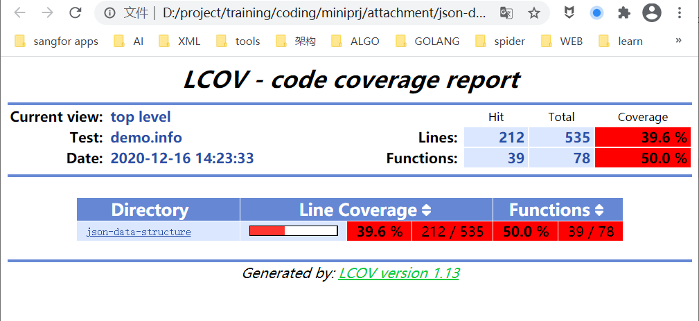
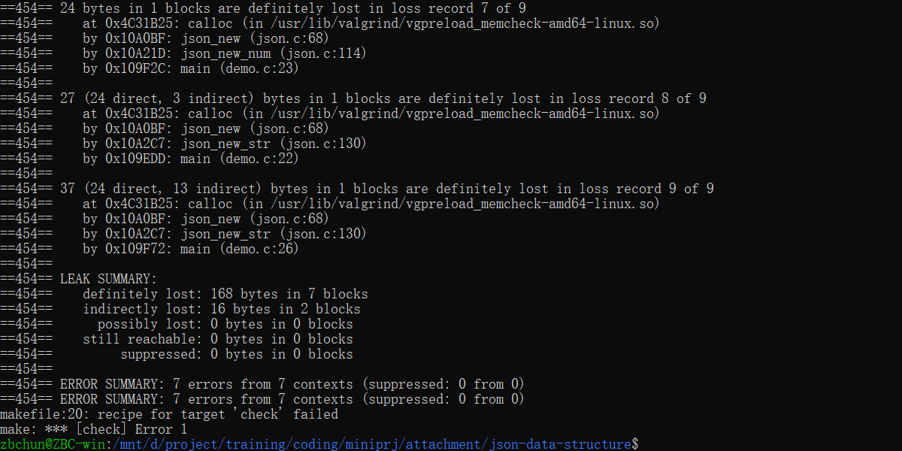

# 环境使用说明

## 开发环境安装

### 安装依赖工具

#### 1. Linux系统

安装Linux系统，可以是虚拟机或者Win10的WSL环境。
实在没有Linux环境，可以安装msys2, cygwin环境替代。

如果采用msys2，cygwin环境，可能无法使用lcov和valgrind工具。
请使用gcov代替lcov输出覆盖率数据。
使用BoundCheckers，Purify等工具查找内存相关问题。

#### 2. 安装编译工具(gcc，make)

安装编译工具gcc，make。

#### 3. 安装覆盖率报告分析工具lcov

安装lcov，lcov是生成覆盖率报告的工具: 

```
sudo apt install lcov
```

#### 4. 安装动态调试工具valgrind

安装valgrind，valgrind是动态调试工具，用于查泄露和指针问题: 

```
sudo apt install valgrind
```

### 源码安装

apt是ubuntu的命令，其它系统可以用rpm或yum，pacman等安装工具。

也可以百度相关工具的源码，下载后编译安装。

源码安装容易遇到编译失败的情况，一般是依赖组件版本太低造成的，请升级依赖组件版本，必要时百度相关资料解决。

### 安装结果验证

安装完毕后，请执行以下命令验证环境工作正常。

```
make;make test;make lcov;make check;
```

这几条命令的具体作用，请参考“编译测试过程”。

## 编译测试过程

### 1. 编译

```
make
```

运行结果：

```
zbchun@ZBC-win:json-data-structure$ make
gcc -Wall -g -fprofile-arcs -ftest-coverage -c -o json.o json.c
gcc -Wall -g -fprofile-arcs -ftest-coverage -c -o demo.o demo.c
gcc -Wall -g -fprofile-arcs -ftest-coverage -c -o test_main.o test_main.c
gcc -Wall -g -fprofile-arcs -ftest-coverage -c -o xtest.o xtest.c
gcc -Wall -o demo demo.o json.o -lgcov
gcc -Wall -o test xtest.o test_main.o json.o -lgcov
```

### 2. 运行测试代码

```
make test
```

也可直接执行编译出来的单元测试程序。

```
./test --fork
```

运行结果：

```
gcc -Wall -g -fprofile-arcs -ftest-coverage -c -o json.o json.c
gcc -Wall -g -fprofile-arcs -ftest-coverage -c -o demo.o demo.c
gcc -Wall -g -fprofile-arcs -ftest-coverage -c -o test_main.o test_main.c
gcc -Wall -g -fprofile-arcs -ftest-coverage -c -o xtest.o xtest.c
gcc -Wall -o demo demo.o json.o -lgcov
gcc -Wall -o test xtest.o test_main.o json.o -lgcov
./test --fork
[INFO     ]: Total 7 case(s) found.
[START    ]: Testing json_get.self in test_main.c:61
JSON path invalid
path: hello
      ^
[       OK]: Pass
[START    ]: Testing json_obj_get_str.exist in test_main.c:31
[     FAIL]: Assertion fail: NULL != json_add_member(json, "ip", json_new_str("200.200.3.61")) is not true (test_main.c:36)
[START    ]: Testing json_obj_get_str.notexist in test_main.c:45
[     FAIL]: Assertion fail: NULL != json_add_member(json, "ip", json_new_str("200.200.3.61")) is not true (test_main.c:50)
[START    ]: Testing json_save.obj in test_main.c:153
open file [test-obj.yml] failed
[     FAIL]: Exit with code: 0, signal: 11 (xtest.c:440)
[START    ]: Testing json_save.special_str in test_main.c:138
open file [test.yml] failed
[     FAIL]: Exit with code: 0, signal: 11 (xtest.c:440)
[START    ]: Testing json_save.str in test_main.c:123
open file [test.yml] failed
[     FAIL]: Exit with code: 0, signal: 11 (xtest.c:440)
[START    ]: Testing test.scene in test_main.c:8
[     FAIL]: Assertion fail: NULL != json_add_member(json, "basic", basic) is not true (test_main.c:15)
```

### 3. 生成覆盖率数据报告

```
make lcov
```

覆盖率数据的报告生成前，需要注意先运行待测程序，产生必要的覆盖率数据。

运行结果：

```
zbchun@ZBC-win:json-data-structure$ make lcov
lcov -d ./ -t 'demo' -o 'demo.info' -b . -c
Capturing coverage data from ./
Found gcov version: 7.5.0
Scanning ./ for .gcda files ...
Found 3 data files in ./
Processing json.gcda
Processing test_main.gcda
Processing xtest.gcda
Finished .info-file creation
genhtml -o demo_web demo.info
Reading data file demo.info
Found 3 entries.
Found common filename prefix "/mnt/d/project/training/coding/miniprj/attachment"
Writing .css and .png files.
Generating output.
Processing file json-data-structure/json.c
Processing file json-data-structure/test_main.c
Processing file json-data-structure/xtest.c
Writing directory view page.
Overall coverage rate:
  lines......: 39.6% (212 of 535 lines)
  functions..: 50.0% (39 of 78 functions)
```

### 4. 查看覆盖率数据

打开`demo_web`目录下的`index.html`，查看覆盖率数据。

典型结果如下：



### 5. 动态调试内存问题

使用valgrind运行demo，查看内存泄漏和指针问题

```
make check
```

也可以直接执行编译出来的demo程序：

```
valgrind --leak-check=full -v ./demo
```

或者利用valgrind运行单元测试用例：

```
valgrind --leak-check=full -v ./test
```

典型结果如下：



## 常见问题

### 1. 使用C++怎么办？

训练过程推荐使用C语言，不建议使用C++。

如果确实需要用到，可以按下述方式操作：

> 将makefile里的`gcc`命令改为`g++`，修改编码命令中的文件名。
>
> 如，将：
>
>   gcc -Wall -g -fprofile-arcs -ftest-coverage -c -o json.o json.c
>
> 修改为：
>
>   g++ -Wall -g -fprofile-arcs -ftest-coverage -c -o json.o json.cpp

### 2. 怎么使用gcov替代lcov进行覆盖率分析

有时lcov无法安装，需要使用gcov替代。gcov是gcc套件的一个组成部分，无需另外安装。

### 3. 安装失败怎么样？

安装失败最常见的问题是底层依赖组件版本过低。将底层组件升级到当前最新版本，一般可以解决。

必要时，可以采用源码方式安装相关工具和库。

### 4. 使用g++test可以吗？

可以，接口和xtest基本一致。可以自行安装g++test，必要时百度相关资料。

### 5. 覆盖率报告生成失败，怎么办？

报告生成有两个前提，一是编译时打开开关`-g -fprofile-arcs -ftest-coverage`，而是要运行待测程序，产生覆盖率数据。
